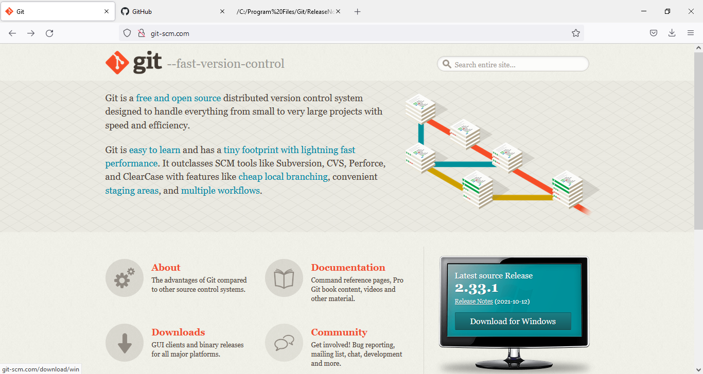
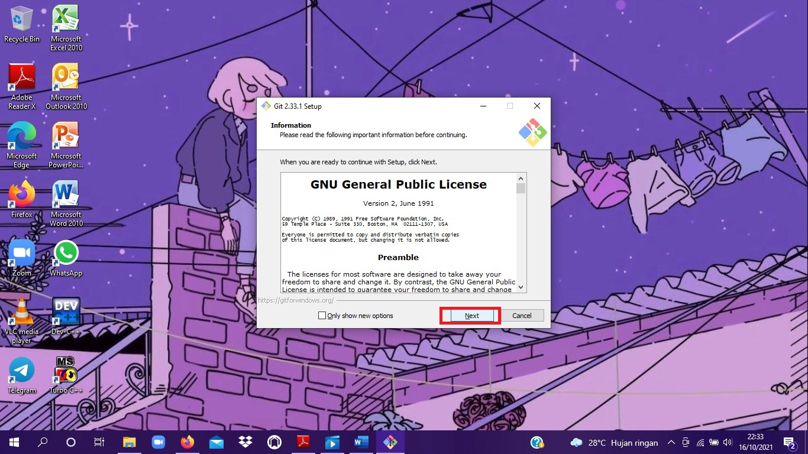
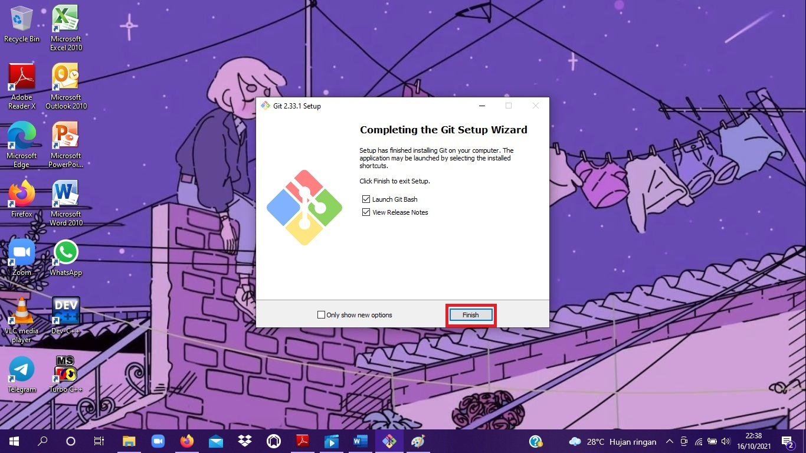
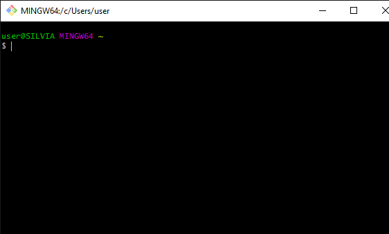
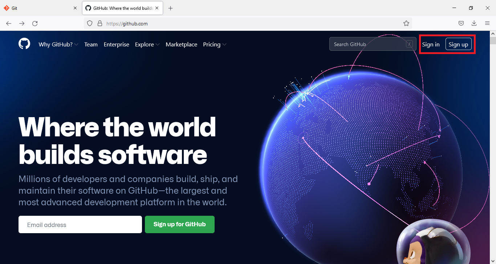
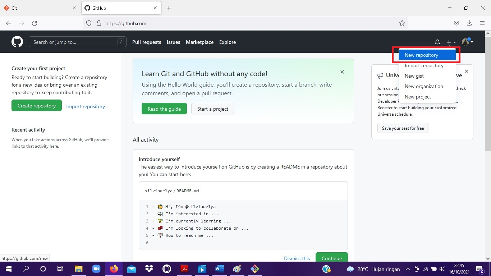
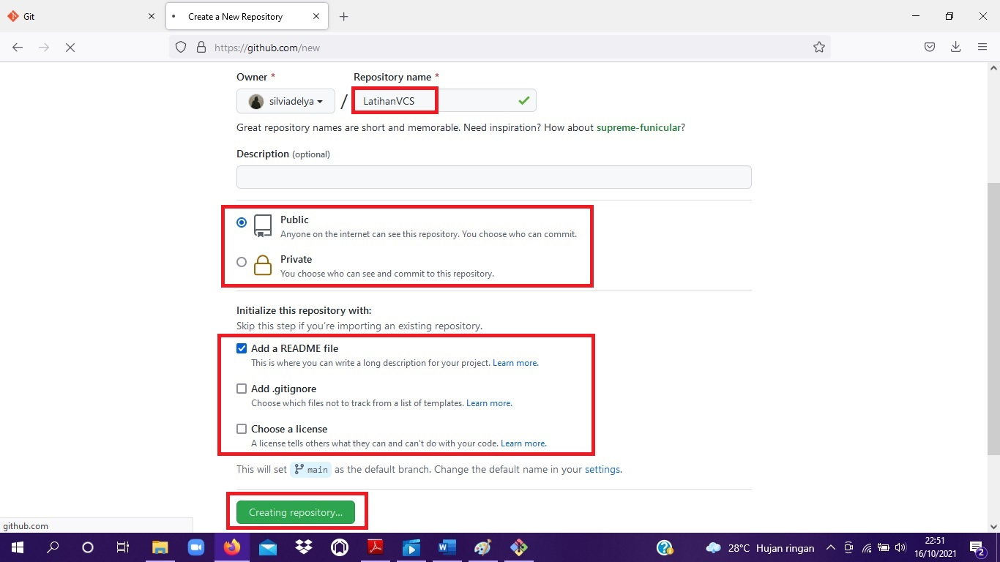

# LatihanVCS
## Tutorial Penggunaan Git

<h1>Menginstall Git</h1>

1. Sebelum menggunakan git, download terlebih dahulu git di <a href="https://git-scm.com">Git</a>

2. Lalu akan muncul tampilan seperti dibawah ini,

3. Kemudian klik "download", dan sesuaikan dengan arsitektur komputer anda.

4. Jika sudah di download, klik "install" lalu klik "next" seperti gambar di bawah ini,

5. Jika sudah sampai pada proses di bawah ini maka proses instalasi berhasil, lalu klik "finish".

6. Kemudian akan muncul command seperti gambar berikut,

<h1>Membuat Repository Server</h1>

1. Membuat akun github terlebih dahulu di <a href="https://github.com">Github</a> . Tampilannya akan seperti dibawah ini,

2. Jika sudah memiliki akun, klik "sign in" lalu masukkan username beserta password. Jika belum klik "sign Up", maka akan ada perintah untuk membuat username, password dan memasukkan alamat email.

3. Setelah selesai membuat akun, akan muncul tampilan seperti di bawah ini,

4. Lalu klik "new repository" (ikon +) 

5. Kemudian isi nama repository, lalu setting repository public/private. Pilih "add a README file", lalu klik "create repository"

