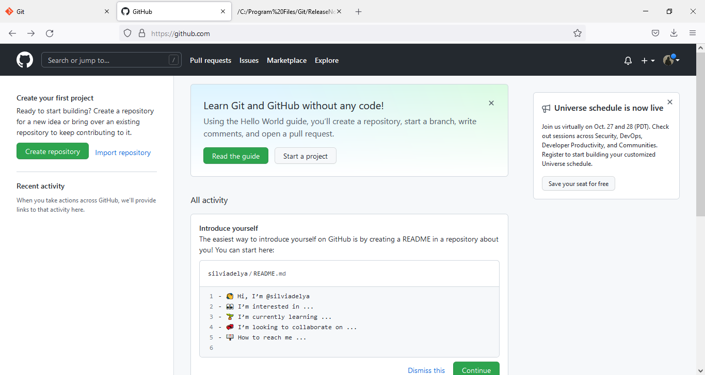

# Tutorial Penggunaan Git

<h1>Menginstall Git</h1>

1. Sebelum menggunakan git, download terlebih dahulu git di <a href="https://git-scm.com">Git</a>

2. Lalu akan muncul tampilan seperti dibawah ini,

3. Kemudian klik "download", dan sesuaikan dengan arsitektur komputer anda.

4. Jika sudah di download, klik "install" lalu klik "next" seperti gambar di bawah ini,

5. Jika sudah sampai pada proses di bawah ini maka proses instalasi berhasil, lalu klik "finish".

6. Kemudian akan muncul command seperti gambar berikut,

<h1>Membuat Repository Server</h1>

1. Membuat akun github terlebih dahulu di <a href="https://github.com">Github</a> . Tampilannya akan seperti dibawah ini,

2. Jika sudah memiliki akun, klik "sign in" lalu masukkan username beserta password. Jika belum klik "sign Up", maka akan ada perintah untuk membuat username, password dan memasukkan alamat email.

3. Setelah selesai membuat akun, akan muncul tampilan seperti di bawah ini,

4. Lalu klik "new repository" (ikon +) 

5. Kemudian isi nama repository, lalu setting repository public/private. Pilih "add a README file", lalu klik "create repository"

6. Jika sudah selesai akan muncul tampilan di bawah ini,

<h1>Menambahkan Global Config</h1>

Buka aplikasi Git, kemudian ketik :

<b>git config --global user.name "nama_user"</b>

<b>git config --global user.email "email_user"</b>

Perintah ini dilakukan saat pertama kali menggunakan git

<h1>Membuat Repository Local</h1>

Gunakan perintah <b>git init</b> . Jika berhasil maka akan muncul tampilan seperti berikut,

<h1>Membuat File Baru Pada Repository</h1>

Gunakan perintah <b>echo "#nama_file" >> README.md</b>

<h1>Menambah File Baru Pada Repository</h1>

Gunakan perintah <b>git add README.md</b>

<h1>Menyimpan Perubahan Ke Database</h1>

Gunakan perintah <b>git commit -m "komentar commit"</b>

<h1>Menambahkan Remote Repository</h1>

Gunakan perintah <b>git remote add origin [url]</b>

<h1>Mengirim Perubahan Ke Server</h1>

Gunakan perintah <b>git push -u origin master</b>

![img] screenshoot/push.jpg